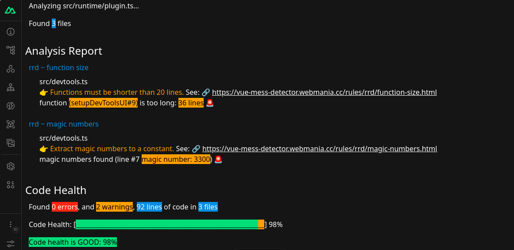

# Vue Mess Detector Nuxt Devtools Plugin

[![npm version][npm-version-src]][npm-version-href]
[![npm downloads][npm-downloads-src]][npm-downloads-href]
[![License][license-src]][license-href]
[![Nuxt][nuxt-src]][nuxt-href]

Vue Mess Detector module integrated with the [Nuxt Devtools](https://github.com/nuxt/devtools).

[Vue Mess Detector](https://vue-mess-detector.webmania.cc/) is a comprehensive code analysis and quality assessment tool.
That provides actionable insights into code health, helping developers identify and resolve potential issues in Vue.js and Nuxt.js projects.

This package contains only the devtools integration; Vue Mess Detector is added as a dependency. 

## Features

- 😻 NPM and JSR Support
- 🤖 PNPM, Bun, Yarn and NPM
- 🔩 Focus on Important Rules
- 🚀 Run the analyzer directly from dev tools

## Quick Setup

1. Add `vue-mess-detector-nuxt-devtools` dependency to your project

```bash
# Using pnpm
pnpm add -D vue-mess-detector-nuxt-devtools

# Using yarn
yarn add --dev vue-mess-detector-nuxt-devtools

# Using npm
npm install --save-dev vue-mess-detector-nuxt-devtools
```

2. Add `vue-mess-detector-nuxt-devtools` to the `modules` section of `nuxt.config.ts`

```js
export default defineNuxtConfig({
  modules: ["vue-mess-detector-nuxt-devtools"],
});
```

That's it! You can now use Vue Mess Detector in your Nuxt app ✨

## Screenshot



## Development

```bash
# Install dependencies
npm install

# Generate type stubs
npm run dev:prepare

# Develop with playground, with devtools client ui
npm run dev

# Develop with playground, with bundled client ui
npm run play:prod

# Run ESLint
npm run lint

# Run Vitest
npm run test
npm run test:watch

# Release new version
npm run release
```

<!-- Badges -->

[npm-version-src]: https://img.shields.io/npm/v/vue-mess-detector-nuxt-devtools/latest.svg?style=flat&colorA=18181B&colorB=28CF8D
[npm-version-href]: https://npmjs.com/package/vue-mess-detector-nuxt-devtools
[npm-downloads-src]: https://img.shields.io/npm/dm/vue-mess-detector-nuxt-devtools.svg?style=flat&colorA=18181B&colorB=28CF8D
[npm-downloads-href]: https://npmjs.com/package/vue-mess-detector-nuxt-devtools
[license-src]: https://img.shields.io/npm/l/vue-mess-detector-nuxt-devtools.svg?style=flat&colorA=18181B&colorB=28CF8D
[license-href]: https://npmjs.com/package/vue-mess-detector-nuxt-devtools
[nuxt-src]: https://img.shields.io/badge/Nuxt-18181B?logo=nuxt.js
[nuxt-href]: https://nuxt.com
